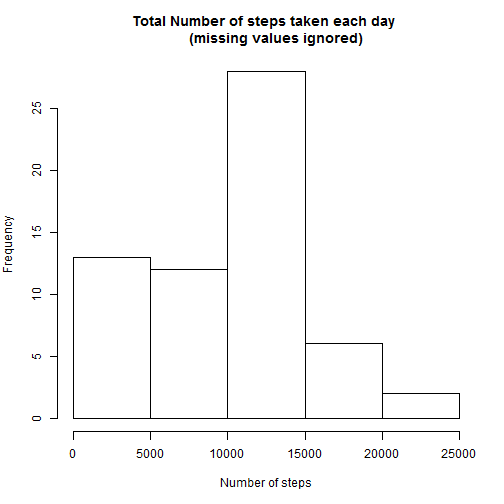
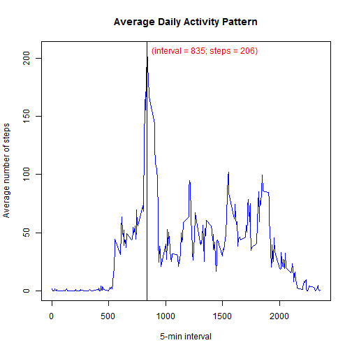
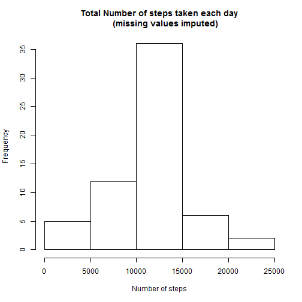
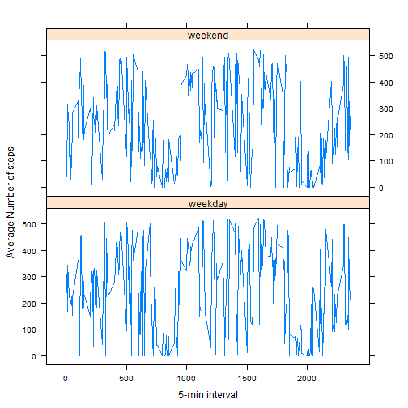

Reproducible Research: Peer Assessment 1
========================================

*By: Carlos J. CHAVARRIA*

*E-mail: carlos.chavarria.loor@gmail.com*

*Reproducible Research course taken on [Coursera](http://www.coursera.org/)*

## 1. Introduction

It is now possible to collect a large amount of data about personal movement using activity monitoring devices such as a Fitbit, Nike Fuelband, orJawbone Up. These type of devices are part of the "quantified self" movement - a group of enthusiasts who take measurements about themselves regularly to improve their health, to find patterns in their behavior, or because they are tech geeks. But these data remain under-utilized both because the raw data are hard to obtain and there is a lack of statistical methods and software for processing and interpreting the data.

This assignment makes use of data from a personal activity monitoring device. This device collects data at 5 minute intervals through out the day. The data consists of two months of data from an anonymous individual collected during the months of October and November, 2012 and include the number of steps taken in 5 minute intervals each day.

## 2. Data description

The data for this assignment, includes the following variables:

* steps: Number of steps taking in a 5-minute interval (missing values are coded as NA)
* date: The date on which the measurement was taken in YYYY-MM-DD format
* interval: Identifier for the 5-minute interval in which measurement was taken

The dataset is stored in a comma-separated-value (CSV) file and there are a total of 17,568 observations in this dataset.

## 3. Loading and preprocessing the data

The first step for the completion of this project entailed reading the dataset into R and transforming it in such a way that the number of steps are in a daily basis, so that 61 observations remain in the preprocessed dataset.

The following code perfoms that task:


```r
activity <- read.csv("activity.csv", header = TRUE)
daily.steps <- with(activity, tapply(steps, date, sum, na.rm=TRUE))
daily.activity <- data.frame(cbind(unique(activity$date), daily.steps))
str(activity)
```

```
## 'data.frame':	17568 obs. of  3 variables:
##  $ steps   : int  NA NA NA NA NA NA NA NA NA NA ...
##  $ date    : Factor w/ 61 levels "2012-10-01","2012-10-02",..: 1 1 1 1 1 1 1 1 1 1 ...
##  $ interval: int  0 5 10 15 20 25 30 35 40 45 ...
```

## 4. What is the mean of the total number of steps taken per day?

Using the preprocessed data, described in the previous section, a distribution of the total number of steps taken each day, as well as the mean and median of that variable is reported. The following code displays the histogram, ignoring the missing values reported in the original dataset.


```r
par(mar = c(5, 4, 4, 2))
with(daily.activity, 
     hist(daily.steps, main = "Total Number of steps taken each day 
     (missing values ignored)", xlab = "Number of steps"))
```

 

According to the results reported in the histogram, in 28 days of the 2-month period, the subject of the investigation took between 10 to 15 thousand steps per day. The reported mean and median are 9.35 and 10.40 thousand daily steps, respectively. 

Note that the median is slightly above the mean because the distribution of the total number of steps taken each day has a slightly positive skeweness.


```r
mean(daily.activity$daily.steps, na.rm = TRUE)
```

```
## [1] 9354.23
```

```r
median(daily.activity$daily.steps, na.rm = TRUE)
```

```
## [1] 10395
```


## 5. What is the average daily activity pattern?

To measure the activity pattern of the average number of steps taken in a 5-minute interval, a new data base was built. In this new dataset, averages of the number of steps were computed for each 5-minute interval identified in the interval variable.

The code that follows construct this new dataset, called 'aadp' (average activity daily pattern):


```r
m.steps <- with(activity, tapply(steps, interval, mean, na.rm=TRUE))
aadp <- data.frame(cbind(unique(activity$interval), m.steps))
colnames(aadp) <- c("interval", "m.steps")
str(aadp)
```

```
## 'data.frame':	288 obs. of  2 variables:
##  $ interval: num  0 5 10 15 20 25 30 35 40 45 ...
##  $ m.steps : num  1.717 0.3396 0.1321 0.1509 0.0755 ...
```

With the dataset describe above, a linear plot was constructed to show the relationship between the 5-min interval of the day and the average number of steps. According to the plot, the interval 835, contains the maximum number of steps, averaged across that interval for the 2-month period considered. The maximum average number of steps is 206 a day, which is reported in the figure below.


```r
with(aadp, plot(interval, m.steps, type = "l", 
     col = "blue",
     main = "Average Daily Activity Pattern",
     xlab = "5-min interval",
     ylab = "Average number of steps"))
interval <- aadp[aadp$m.steps==max(m.steps), "interval"]
text(x = interval, y = max(m.steps), label="(interval = 835; steps = 206)", pos = 4, 
     col = "red")
abline(v = 835)
```

 

## 6. Imputing missing values

In the original dataset, 2304 of 17568 observations in the 'steps' variable were reported as missing values. The following code performs a procedure which imputs, for the missing data in the 'steps' variable, the average daily mean of steps for each 5-min interval identified. 

This procedure was performed as follows; and the resulted dataset, were no missing value is reported, was called 'new.activity'.


```r
new.activity <- merge(activity, aadp, by.x="interval", by.y="interval")
new.activity$new.steps <- 0
for (i in 1:nrow(new.activity)) {
        if (is.na(new.activity$steps[i]) == "TRUE") {
                new.activity$new.steps[i] <- new.activity$m.steps[i]
        }
        else {
                new.activity$new.steps[i] <- new.activity$steps[i]
        }
}
new.activity <- new.activity[ ,c("interval", "date", "new.steps")]
str(new.activity)
```

```
## 'data.frame':	17568 obs. of  3 variables:
##  $ interval : int  0 0 0 0 0 0 0 0 0 0 ...
##  $ date     : Factor w/ 61 levels "2012-10-01","2012-10-02",..: 1 54 28 37 55 46 20 47 38 56 ...
##  $ new.steps: num  1.72 0 0 0 0 ...
```

A histogram, the mean, and the median of the number of steps taken each day was computed after imputing the daily average number of steps in each 5-min. interval. 

The distribution of the number of steps taken each day is the following:


```r
daily.new.steps <- with(new.activity, tapply(new.steps, date, sum, na.rm=TRUE))
daily.new.activity <- data.frame(cbind(unique(new.activity$date), daily.new.steps))
with(daily.new.activity, 
     hist(daily.new.steps, main = "Total Number of steps taken each day
     (missing values imputed)", xlab = "Number of steps"))
```

 

The mean and median of the number of steps taken each day is 10766 steps. Note that after imputing the missing values, both the mean and median are equal since the skewness in the distribution dissappears (it becomes more symmetric).


```r
mean(daily.new.activity$daily.new.steps, na.rm = TRUE)
```

```
## [1] 10766.19
```

```r
median(daily.new.activity$daily.new.steps, na.rm = TRUE)
```

```
## [1] 10766.19
```

## 7. Are there differences in activity patterns between weekdays and weekends?

For answering this question, the original dataset was reprocessed in order to include a new factor variable that differentiates the observations into two groups (weekends and weekdays). Again, the average of the number of steps taken each day was computed, but in this case averages were taken over both the 5-min. interval and the variable that creates the groups mentioned. The code that follows implements this procedure.


```r
new.activity$days <- weekdays(as.POSIXct(new.activity$date, tz="GMT"), abbreviate = TRUE)
new.activity$g <- as.numeric(factor(new.activity$days, 
                            levels = c("lun", "mar", "mié", "jue", "vie", "sáb", "dom")))
new.activity$g <- ifelse(new.activity$g<6, "weekday", "weekend")
new.activity$fac <- paste(new.activity$g,"_",as.character(new.activity$interval)) 
m.new.steps <- with(new.activity, tapply(new.steps, fac, mean))
aadp.new <- data.frame(cbind(unique(new.activity$fac), m.new.steps))
aadp.new$g <- factor(substr(as.character(aadp.new$V1),1, 7))
aadp.new$interval <- as.numeric(substr(as.character(aadp.new$V1),11, 14))
aadp.new$m.new.steps <- as.numeric(aadp.new$m.new.steps)
aadp.new <- aadp.new[ ,c("m.new.steps", "interval", "g")]      
str(aadp.new)
```

```
## 'data.frame':	576 obs. of  3 variables:
##  $ m.new.steps: num  185 28 47 309 166 313 345 267 294 286 ...
##  $ interval   : num  0 0 5 5 10 10 15 15 20 20 ...
##  $ g          : Factor w/ 2 levels "weekday","weekend": 1 2 2 1 1 2 1 2 1 2 ...
```

The line plot below displays the average number of steps taken each day, differentiating among weekends and weekdays. According to the results, no significant changes in the daily average number of steps is reported for the subject studied.


```r
library(lattice)
xyplot(m.new.steps ~ interval | g, data = aadp.new, layout = c(1, 2),
       xlab = "5-min interval",
       ylab = "Average Number of steps",
       type ="l")
```

 
